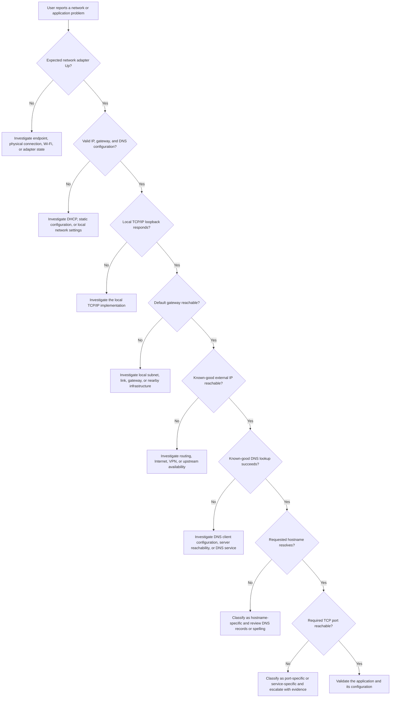

# Layered Network Troubleshooting Flow

## Purpose
This diagram summarizes the evidence-based troubleshooting sequence applied across the three controlled cases in this lab.

## Interpretation
Each successful test validates only its own layer. ICMP success does not prove that DNS or an application port works, and a TCP timeout does not identify whether a port is closed, filtered, unsupported, or associated with an unavailable service.

## Safety and Privacy
The flow uses generic decisions and contains no endpoint names, usernames, IP addresses, MAC addresses, SSIDs, or private network details.

